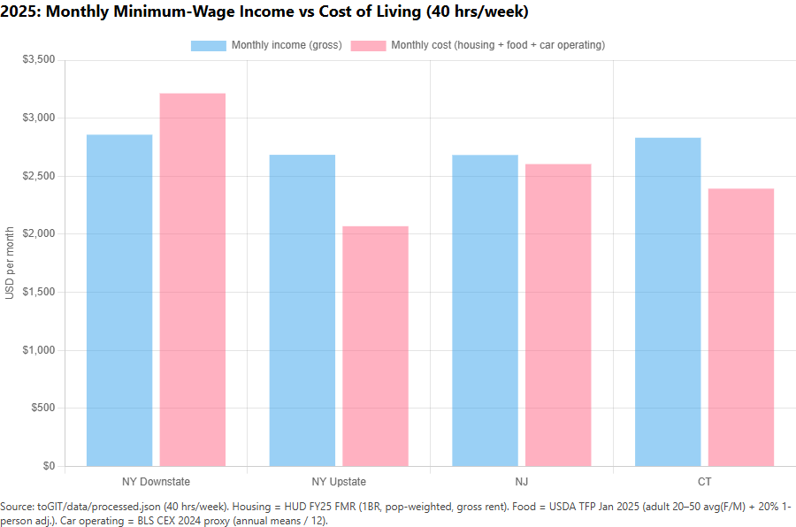

# Minimum Wage vs Cost of Living (NY / NJ / CT) — 2025 Reality Check

## Essential Question (1 sentence)
Does working full-time at minimum wage cover the average cost of living in New York, New Jersey, and Connecticut in 2025?

## Claim (Hypothesis) (1 sentence; can be wrong)
Working full-time at minimum wage does not cover the basic cost of living everywhere in the tri-state area in 2025.

## Audience (who is this for?)
College students, recent grads, and early-career workers comparing affordability across the tri-state area.

## STAR Draft (bullets)
- **S — Situation:** Students often assume a full-time job “should” cover basic living costs, but the gap between wages and expenses varies sharply by state and region.
- **T — Task:** Help a viewer determine whether minimum wage income covers basic living costs in NY/NJ/CT, and quantify the monthly shortfall or surplus.
- **A — Action:** Build an interactive data story (2–4 views) that compares minimum wage income to a defined cost-of-living benchmark, with an hours-worked slider and a region selector.
- **R — Result:** Report the **Income Gap** (monthly income − monthly cost of living) and a coverage ratio for each state (and NY regions if needed).

## Dataset & Provenance (source links + retrieval date + license/usage)
**Minimum wage (2025):**
- NY: NYS Department of Labor — minimum wage history (retrieved 2026-03-08)
	- https://dol.ny.gov/history-minimum-wage-new-york-state
- NJ: NJ Department of Labor press release (retrieved 2026-03-08)
	- https://www.nj.gov/labor/lwdhome/press/2024/20241008_minwage.shtml
- CT: CT Governor press release (retrieved 2026-03-08)
	- https://portal.ct.gov/governor/news/press-releases/2024/09-2024/governor-lamont-announces-minimum-wage-will-increase-in-2025/

**Cost of living (2025):**
- Constructed basic monthly budget (license-safe, open government sources; retrieved 2026-03-08):
	- Housing: HUD FY2025 Fair Market Rents (FMR) bulk file (1-bedroom, population-weighted by `pop2022`)
		- https://www.huduser.gov/portal/datasets/fmr/fmr2025/FY25_FMRs.xlsx
	- Food: USDA Thrifty Food Plan (U.S. average), January 2025
		- https://fns-prod.azureedge.us/sites/default/files/resource-files/Cost_Of_Food_Thrifty_Food_Plan_January_2025.pdf
	- Car operating (proxy): BLS Consumer Expenditure Surveys (CEX) publication tables — All consumer units, multi-year means (2021–2024). Uses 2024 annual means as a proxy for 2025.
		- https://www.bls.gov/cex/tables/calendar-year/mean/cu-all-multi-year-2021-2024.xlsx
	- Note: HUD FMR is defined as **gross rent** (rent + utilities), so we do not add a separate utilities line item.
	- Household: 1 adult, 0 children
	- NY handling: split into Downstate vs Upstate (Downstate = NYC + Nassau + Suffolk + Westchester; Upstate = remainder)

## Data Dictionary (minimum 5 rows: column → meaning → units)
| Column | Meaning | Units |
|---|---|---|
| `state` | State code (NY/NJ/CT) | text |
| `region` | Region label (NY Downstate / NY Upstate / NJ statewide / CT statewide) | text |
| `hourly_min_wage` | Minimum wage for the geography and year | USD/hour |
| `hours_per_week` | Hours worked per week (interactive control) | hours/week |
| `monthly_income` | `hourly_min_wage * hours_per_week * 4.33` | USD/month |
| `monthly_cost_of_living` | Defined monthly cost-of-living benchmark (by state/region) | USD/month |
| `income_gap` | `monthly_income - monthly_cost_of_living` | USD/month |
| `coverage_ratio` | `monthly_income / monthly_cost_of_living` | ratio |

## Data Viability Audit
### Missing values + weird fields
- NY minimum wage is region-specific. For this project we will report NY as two groups:
	- **Downstate NY** (NYC + Long Island + Westchester)
	- **Upstate NY** (remainder of NY)
- Cost-of-living benchmark is “basic” (housing + food + a car operating proxy), so it will still undercount full expenses like healthcare, taxes, and many other costs.

### Cleaning plan
- Normalize state + region labels.
- Lock to 2025 values (and optionally do a small 2026-to-date comparison if it materially changes the conclusion).
- Document the `4.33 = 52/12` conversion to avoid unexplained magic numbers.

## Definitions
- **Monthly income:** `hourly_min_wage * hours_per_week * 4.33` where `4.33 ≈ 52/12`.
- **Monthly cost of living (basic):** `housing (HUD FMR 1BR, pop-weighted) + food (USDA TFP Jan 2025) + car operating (BLS CEX 2024 proxy / 12)`.
- **Income Gap:** `monthly_income - monthly_cost_of_living`.

## Cleaning & Transform Notes
- **NY wages:** reported as **Downstate vs Upstate** (Downstate = NYC + Nassau + Suffolk + Westchester; Upstate = remainder).
- **Housing:** derived from HUD FY25 FMR `fmr_1` (1-bedroom) using population-weighted averages by `pop2022`.
- **Food:** derived from USDA TFP Jan 2025 (adult 20–50 monthly cost for Female and Male averaged, then +20% 1-person adjustment).
- **Reproducibility:** `data/raw.json` and `data/processed.json` are generated deterministically from Toolkit inputs.

### What this dataset cannot prove (limits/bias)
- Any “average cost of living” benchmark involves assumptions (household type, geography aggregation, included categories).
- State-level averages can hide large within-state variation (especially for NY).
- This benchmark is intentionally “basic” (housing + food + a car operating proxy). It does not include expenses like payroll/income taxes, healthcare, childcare, or car ownership costs (payments/insurance), and it is not tailored to local commuting patterns.

### What I’d do next (if I had more time)
- Add one or two additional cost categories with transparent sources (e.g., healthcare + taxes) and show how conclusions shift.
- Add a second household scenario (e.g., 1 adult + 1 child) to demonstrate sensitivity to household type assumptions.
- Replace statewide NJ/CT with a simple regional split (if data supports it) to reduce the “state average hides variation” limitation.
- Add a short methods appendix page/section that lists the exact formulas and the data-reduction steps (weights, conversions).

### Demo day flow (3–5 minutes)
1. **Claim:** Minimum wage doesn’t reliably cover a basic monthly budget across the tri-state area.
2. **Context:** Show View 1 (hourly wages) and highlight the focus region.
3. **Evidence:** Show View 2 (cost components) to explain what drives the benchmark.
4. **Interaction:** Adjust hours/week and show how the Income Gap changes in View 3.
5. **Limitation:** Call out what’s not included (taxes/healthcare/childcare/car ownership).
6. **Takeaway:** A single hourly wage number is incomplete; affordability depends on both hours and local costs.

## Draft Chart Screenshot (from Sheets/Excel) + 2 bullets
- Screenshot (generated):

- Why this chart answers the question:
	- It directly compares monthly minimum-wage income to monthly living costs using consistent units.
	- It exposes the *magnitude* of the gap (not just the ranking).

## Prototype App (Sprint 3 + Sprint 4)
- Deployment URL: https://student-reality-lab.vercel.app/

Run locally:
- If this folder is the repo root: `cd .`
- If this folder is nested in a larger workspace: `cd Midterm_Project/toGIT`
- `npm install` (if PowerShell blocks scripts, use `npm.cmd install`)
- `npm run dev` (then open http://localhost:3000; fallback: `npm.cmd run dev`)

Deploy (minimal guidance):
- **Root directory:** this folder (use `Midterm_Project/toGIT` only if deploying from a larger monorepo)
- **Build command:** `npm run build`
- **Output:** Next.js default
- **Start command (if needed):** `npm run start`
- Works on **Vercel** (recommended) or **Netlify** as a standard Next.js app.

### Interaction Design (Phase 4)
- **Three views (one page):**
	- View 1: Wage context (USD/hour)
	- View 2: Cost of living breakdown (housing + food + car operating proxy)
	- View 3: Monthly income vs monthly cost + Income Gap
- **Interactions (2):**
	- Region selector highlights one region across all views.
	- Hours/week slider (20–60, default 40) recomputes monthly income + Income Gap from `data/raw.json`.
- **Annotations:** Each view includes a short annotation tied to a specific data point (highest wage, highest housing benchmark, biggest shortfall).

## Presentation
- Talk track / STAR script: see `PRESENTATION.md`
